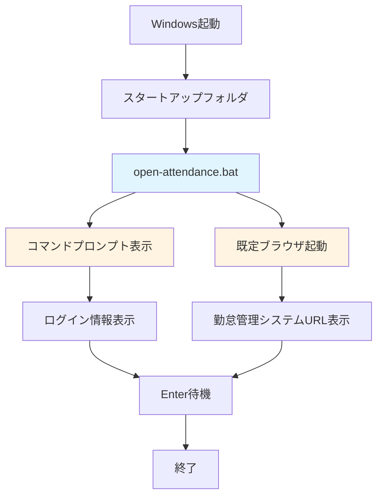
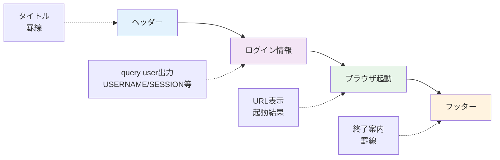
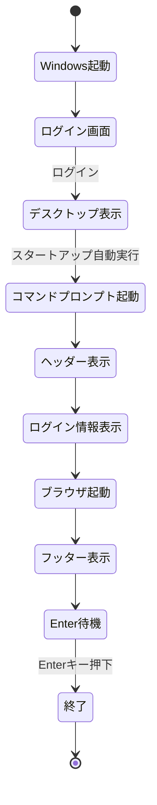

# 外部設計書

**プロジェクト名:** 勤怠管理システム自動起動バッチ  
**作成日:** 2025-12-07  
**バージョン:** 1.0  
**ステータス:** 確定

---

## 1. システム概要

### 1.1 システム構成


### 1.2 ファイル構成
```
batch-files/
├── open-attendance.bat          # メインバッチファイル
├── requirements.md              # 要件定義書
├── external-design.md           # 外部設計書（本ファイル）
├── internal-design.md           # 内部設計書
├── SETUP_GUIDE.md               # セットアップ手順書
├── USER_MANUAL.md               # ユーザーマニュアル
├── TEST_PLAN.md                 # テスト計画書
└── README.md                    # プロジェクト概要
```

---

## 2. 入力仕様

### 2.1 設定ファイル入力
バッチファイル内に設定を直接記述する方式を採用。

| 項目 | 変数名 | 型 | 必須/任意 | デフォルト値 | 説明 |
|------|--------|-----|---------|------------|------|
| 勤怠管理システムURL | ATTENDANCE_URL | 文字列 | 必須 | `https://company.example.com/attendance` | 開くURLを指定 |

### 2.2 環境変数
システムは以下の環境変数を参照する。

| 環境変数 | 用途 |
|---------|------|
| `%USERNAME%` | 現在のユーザー名（間接的にquery userコマンドで使用） |
| `%USERPROFILE%` | ユーザープロファイルパス（スタートアップフォルダ特定用） |

---

## 3. 出力仕様

### 3.1 コンソール出力

#### 3.1.0 出力セクション構成図


#### 3.1.1 正常時の出力フォーマット
```
=====================================
  勤怠管理システム自動起動
=====================================

【ログイン情報】
USERNAME      SESSIONNAME    ID  STATE       IDLE TIME  LOGON TIME
user01        console        0   アクティブ   5          2025/12/07 09:00

【ブラウザ起動】
ブラウザで以下のURLを開いています...
https://company.example.com/attendance

✓ ブラウザが起動しました

=====================================
[Enterキーを押してこのウィンドウを閉じてください]
=====================================
```

#### 3.1.2 出力項目詳細

| セクション | 項目 | 説明 |
|---------|------|------|
| ヘッダー | タイトル | `勤怠管理システム自動起動` |
| ログイン情報 | USERNAME | ログインユーザー名 |
| | SESSIONNAME | セッション名（通常は`console`） |
| | ID | セッションID（通常は`0`） |
| | STATE | セッション状態（`アクティブ` / `切断`） |
| | IDLE TIME | 最後の操作からの経過時間（分） |
| | LOGON TIME | ログオン日時 |
| ブラウザ起動 | URL表示 | 開こうとしているURL |
| | 起動結果 | 成功メッセージまたは警告メッセージ |
| フッター | 終了案内 | Enterキー押下の案内 |

### 3.2 エラーメッセージ

#### 3.2.1 URL未設定エラー
```
【ブラウザ起動】
エラー: URLが指定されていません。
バッチファイルを編集して、ATTENDANCE_URLを設定してください。
```

#### 3.2.2 ログイン情報取得失敗エラー
```
【ログイン情報】

エラー: ユーザー情報の取得に失敗しました
```

#### 3.2.3 ブラウザ起動失敗警告
```
【ブラウザ起動】
ブラウザで以下のURLを開いています...
https://company.example.com/attendance

警告: ブラウザの起動に失敗しました。
手動で上記のURLをブラウザで開いてください。
```

### 3.3 ブラウザ出力
- **対象:** 既定ブラウザ（Edge / Chrome / Firefox等）
- **表示内容:** 勤怠管理システムのURL
- **起動タイミング:** バッチ実行から3秒以内
- **ウィンドウ状態:** 通常ウィンドウ（最大化・最小化なし）

---

## 4. ユーザーインターフェース設計

### 4.1 コマンドプロンプトウィンドウ

#### 4.1.1 ウィンドウ設定
| 項目 | 設定値 |
|------|--------|
| タイトル | `勤怠管理システム自動起動` |
| 背景色 | 黒（`0`） |
| 文字色 | 明るい白（`F`） |
| サイズ | デフォルト（80列×25行） |
| 位置 | システムデフォルト |

#### 4.1.2 表示レイアウト
```
┌─────────────────────────────────────────┐
│ 勤怠管理システム自動起動                │  ← ウィンドウタイトル
├─────────────────────────────────────────┤
│                                         │
│ ===================================== │  ← ヘッダー罫線
│   勤怠管理システム自動起動            │
│ ===================================== │
│                                         │
│ 【ログイン情報】                        │
│ USERNAME   SESSIONNAME  ID  STATE ...  │  ← query user出力
│                                         │
│ 【ブラウザ起動】                        │
│ ブラウザで以下のURLを開いています...   │
│ https://company.example.com/attendance │
│                                         │
│ ✓ ブラウザが起動しました               │
│                                         │
│ ===================================== │  ← フッター罫線
│ [Enterキーを押してこのウィンドウを...] │
│ ===================================== │
│                                         │
│ 続行するには何かキーを押してください... │  ← pauseメッセージ
└─────────────────────────────────────────┘
```

### 4.2 ブラウザウィンドウ
- **表示タイミング:** コマンドプロンプトにメッセージ表示直後
- **ウィンドウ状態:** 新規タブまたは新規ウィンドウ（ブラウザ設定依存）
- **フォーカス:** ブラウザウィンドウにフォーカスが移動

---

## 5. 配置・インストール仕様

### 5.1 配置場所

#### 5.1.1 推奨配置（個別ユーザー用）
```
C:\Users\{ユーザー名}\AppData\Roaming\Microsoft\Windows\Start Menu\Programs\Startup\open-attendance.bat
```

**アクセス方法:**
- `Win + R` → `shell:startup` → Enter

#### 5.1.2 代替配置（全ユーザー用）
```
C:\ProgramData\Microsoft\Windows\Start Menu\Programs\Startup\open-attendance.bat
```

**注意:** 管理者権限が必要

### 5.2 ファイル仕様

| 項目 | 仕様 |
|------|------|
| ファイル名 | `open-attendance.bat` |
| ファイル形式 | Windows バッチファイル（.bat） |
| 文字コード | Shift-JIS または UTF-8 BOM |
| 改行コード | CRLF（Windows形式） |
| ファイルサイズ | 約2-3 KB |
| 行数 | 約80行（コメント含む） |

---

## 6. 外部インターフェース

### 6.1 Windowsコマンドインターフェース

#### 6.1.1 使用コマンド一覧
| コマンド | 用途 | 戻り値 |
|---------|------|--------|
| `query user` | ログイン情報取得 | 0:成功、1以上:失敗 |
| `start` | ブラウザ起動 | 0:成功、1以上:失敗 |
| `chcp 65001` | 文字コードUTF-8設定 | 0:成功 |
| `pause` | キー入力待機 | なし |

#### 6.1.2 query user出力形式
```
USERNAME      SESSIONNAME    ID  STATE       IDLE TIME  LOGON TIME
user01        console        0   アクティブ   5          2025/12/07 09:00
```

### 6.2 ブラウザインターフェース
- **起動方法:** `start ""`コマンドによるファイル関連付け起動
- **対応ブラウザ:** Windows既定ブラウザ（Edge / Chrome / Firefox等）
- **URL形式:** `https://`または`http://`で始まるURL

---

## 7. セキュリティ設計

### 7.1 情報セキュリティ

| 項目 | 対応 |
|------|------|
| URL情報 | バッチファイル内に平文で記載（社内利用のみ想定） |
| パスワード | URLに埋め込まない（ブラウザログイン画面で入力） |
| ユーザー情報 | ローカルシステムのセッション情報のみ取得（ネットワーク送信なし） |
| ファイルアクセス | 個別ユーザーのスタートアップフォルダに配置（他ユーザーアクセス不可） |

### 7.2 実行権限
- **必要権限:** 通常ユーザー権限
- **管理者権限:** 不要
- **制限事項:** スタートアップフォルダへの書き込み権限のみ必要

---

## 8. パフォーマンス要件

### 8.1 応答時間
| 処理 | 目標時間 |
|------|---------|
| バッチ起動からヘッダー表示まで | 1秒以内 |
| ログイン情報取得 | 1秒以内 |
| ブラウザ起動 | 3秒以内 |
| 全体処理時間 | 5秒以内 |

### 8.2 リソース使用量
| リソース | 使用量 |
|---------|--------|
| メモリ | 10MB以内（コマンドプロンプトプロセス） |
| CPU | 最大5%（瞬間的なピーク） |
| ディスク | 3KB（バッチファイル本体） |

---

## 9. 互換性

### 9.1 対応OS
| OS | バージョン | 対応状況 |
|-----|----------|---------|
| Windows 10 | すべて | ✅ 対応 |
| Windows 11 | すべて | ✅ 対応 |
| Windows Server | 2016以降 | ⚠️ 未検証（動作可能性あり） |
| macOS | - | ❌ 非対応 |
| Linux | - | ❌ 非対応 |

### 9.2 対応ブラウザ
| ブラウザ | 対応状況 |
|---------|---------|
| Microsoft Edge | ✅ 対応 |
| Google Chrome | ✅ 対応 |
| Mozilla Firefox | ✅ 対応 |
| Internet Explorer 11 | ⚠️ 非推奨（動作可能） |

---

## 10. 画面遷移

### 10.1 遷移図


---

## 11. エラー処理方針

### 11.1 エラーレベル
| レベル | 対応 | 例 |
|--------|------|-----|
| エラー（Error） | 処理中断、エラーメッセージ表示 | URL未設定 |
| 警告（Warning） | 処理継続、警告メッセージ表示 | ブラウザ起動失敗 |
| 情報（Info） | 処理継続、情報メッセージ表示 | ブラウザ起動成功 |

### 11.2 エラーメッセージ設計方針
- 簡潔で分かりやすい日本語
- 対処方法を含める
- エラーコードは使用しない（ユーザーフレンドリー重視）

---

## 12. 承認

| 役割 | 名前 | 承認日 | 署名 |
|------|------|--------|------|
| 外部設計者 | __________ | __________ | ☐ |
| レビュー者 | __________ | __________ | ☐ |
| 承認者 | __________ | __________ | ☐ |

---

**作成日:** 2025-12-07  
**最終更新:** 2025-12-07  
**バージョン:** 1.0
