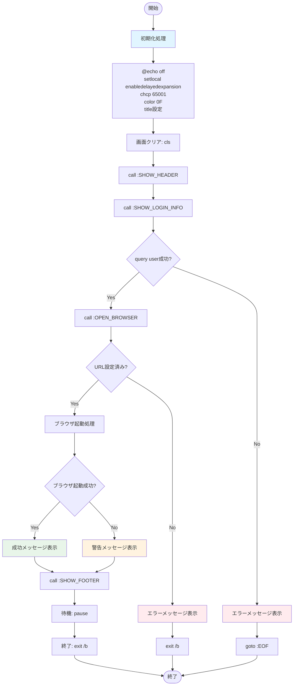
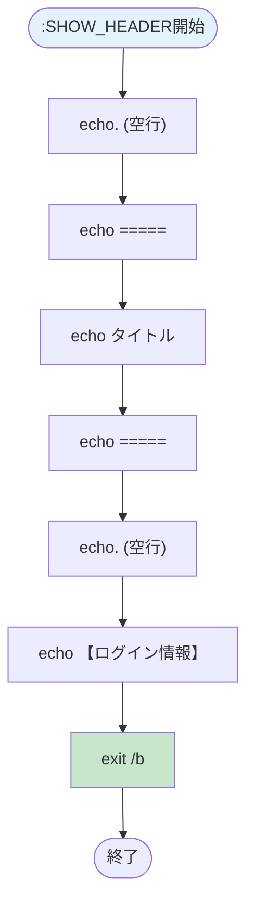
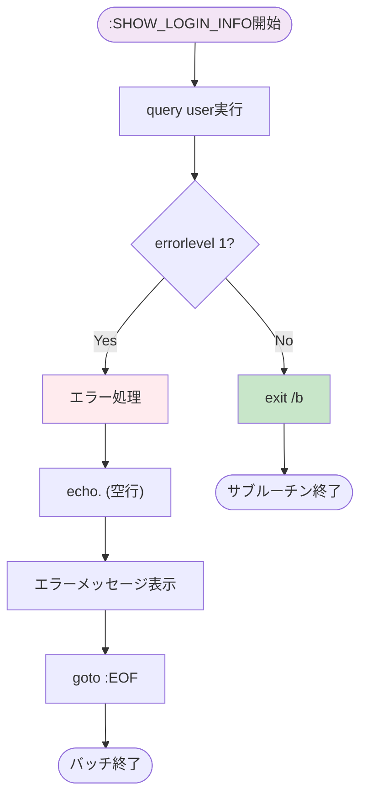
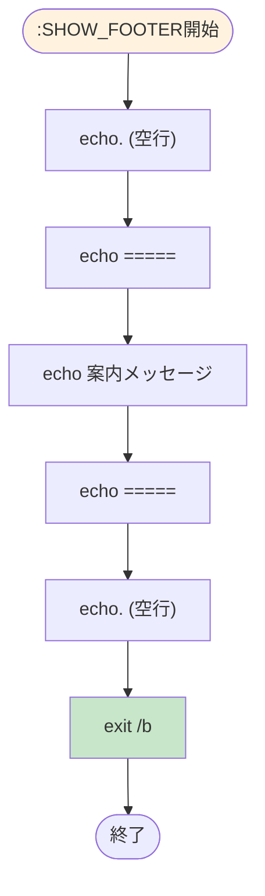
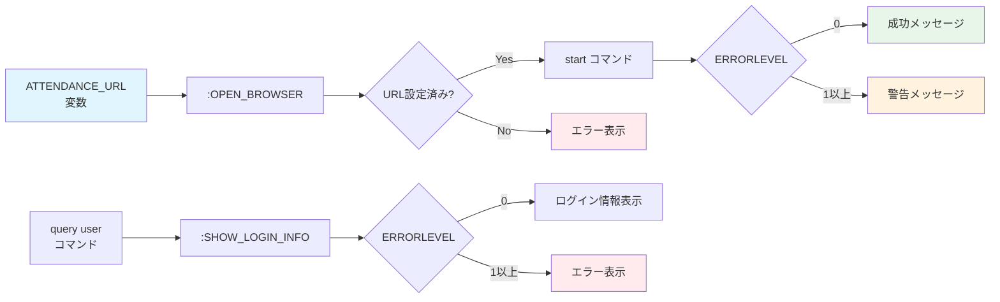

# 内部設計書

**プロジェクト名:** 勤怠管理システム自動起動バッチ  
**作成日:** 2025-12-07  
**バージョン:** 1.0  
**ステータス:** 確定

---

## 1. システム構造

### 1.1 プログラム構成
```
open-attendance.bat
├── [初期化処理]
│   ├── @echo off
│   ├── setlocal enabledelayedexpansion
│   ├── chcp 65001
│   ├── color 0F
│   └── title 設定
│
├── [メイン処理]
│   ├── cls
│   ├── call :SHOW_HEADER
│   ├── call :SHOW_LOGIN_INFO
│   ├── call :OPEN_BROWSER
│   ├── call :SHOW_FOOTER
│   ├── pause
│   └── exit /b
│
└── [サブルーチン]
    ├── :SHOW_HEADER
    ├── :SHOW_LOGIN_INFO
    ├── :OPEN_BROWSER
    └── :SHOW_FOOTER
```

---

## 2. 処理フロー

### 2.1 メイン処理フロー


### 2.2 サブルーチン詳細フロー

#### 2.2.1 :SHOW_HEADER


#### 2.2.2 :SHOW_LOGIN_INFO


#### 2.2.3 :OPEN_BROWSER
```mermaid
flowchart TD
    Start([":OPEN_BROWSER開始"]) --> E1["echo. (空行)"]
    E1 --> E2["echo 【ブラウザ起動】"]
    E2 --> URLCheck{URL未設定?}
    URLCheck -->|Yes| URLError[エラーメッセージ表示]
    URLError --> Exit1["exit /b"]
    Exit1 --> Stop1([サブルーチン終了])
    URLCheck -->|No| ShowURL[URLメッセージ表示]
    ShowURL --> M1["echo ブラウザで..."]
    M1 --> M2["echo %ATTENDANCE_URL%"]
    M2 --> M3["echo. (空行)"]
    M3 --> StartCmd["start \"\" %ATTENDANCE_URL%"]
    StartCmd --> BrowserCheck{errorlevel 1?}
    BrowserCheck -->|Yes| Warn[警告メッセージ表示]
    BrowserCheck -->|No| Success[成功メッセージ表示]
    Warn --> Exit2["exit /b"]
    Success --> Exit2
    Exit2 --> Stop2([サブルーチン終了])
    
    style Start fill:#e8f5e9
    style URLError fill:#ffebee
    style Warn fill:#fff3e0
    style Success fill:#c8e6c9
```

#### 2.2.4 :SHOW_FOOTER


---

## 3. データ設計

### 3.0 データフロー図


### 3.1 変数設計

| 変数名 | 型 | スコープ | 初期値 | 用途 | 編集可否 |
|--------|-----|---------|--------|------|---------|
| ATTENDANCE_URL | 文字列 | ローカル（setlocal） | `https://company.example.com/attendance` | 勤怠管理システムのURL | ✅ 編集必須 |

### 3.2 システム変数

| 変数名 | 型 | 説明 |
|--------|-----|------|
| %ERRORLEVEL% | 整数 | 直前のコマンドの終了コード（0:成功、1以上:失敗） |

### 3.3 定数

本バッチでは明示的な定数定義は行わない。メッセージ文字列は直接echoコマンドで記述。

---

## 4. サブルーチン設計

### 4.1 :SHOW_HEADER

**目的:** ヘッダー、罫線、タイトル、セクション名を表示

**入力:** なし

**出力:** コンソール（標準出力）

**処理内容:**
1. 空行表示（`echo.`）
2. 罫線表示（`echo =====================================`）
3. タイトル表示（`echo   勤怠管理システム自動起動`）
4. 罫線表示（`echo =====================================`）
5. 空行表示（`echo.`）
6. セクション名表示（`echo 【ログイン情報】`）

**エラーハンドリング:** なし

**終了:** `exit /b`

---

### 4.2 :SHOW_LOGIN_INFO

**目的:** ログイン情報の取得と表示

**入力:** なし（query userコマンドがシステム情報を取得）

**出力:** コンソール（query userの出力）

**処理内容:**
1. `query user`コマンド実行
2. `if errorlevel 1`でエラーチェック
   - エラーの場合:
     - 空行表示
     - エラーメッセージ表示（`echo エラー: ユーザー情報の取得に失敗しました`）
     - `goto :EOF`で処理中断
   - 正常の場合:
     - `exit /b`で終了

**エラーハンドリング:** 
- エラー時は`goto :EOF`でバッチ全体を終了
- エラーメッセージを表示

**終了:** `exit /b`または`goto :EOF`

---

### 4.3 :OPEN_BROWSER

**目的:** ブラウザでURLを開く

**入力:** `%ATTENDANCE_URL%`（環境変数）

**出力:** 
- コンソール（メッセージ）
- ブラウザウィンドウ

**処理内容:**
1. 空行表示
2. セクション名表示（`echo 【ブラウザ起動】`）
3. URL未設定チェック
   - `if "%ATTENDANCE_URL%"==""`の場合:
     - エラーメッセージ表示
     - `exit /b`で処理中断
4. URLメッセージ表示
   - `echo ブラウザで以下のURLを開いています...`
   - `echo %ATTENDANCE_URL%`
   - 空行表示
5. ブラウザ起動
   - `start "" %ATTENDANCE_URL%`実行
6. `if errorlevel 1`でエラーチェック
   - エラーの場合: 警告メッセージ表示
   - 正常の場合: 成功メッセージ表示（`echo ✓ ブラウザが起動しました`）

**エラーハンドリング:**
- URL未設定時: エラーメッセージ表示、`exit /b`
- ブラウザ起動失敗時: 警告メッセージ表示、処理継続

**終了:** `exit /b`

---

### 4.4 :SHOW_FOOTER

**目的:** フッター、終了案内メッセージを表示

**入力:** なし

**出力:** コンソール（標準出力）

**処理内容:**
1. 空行表示（`echo.`）
2. 罫線表示（`echo =====================================`）
3. 案内メッセージ表示（`echo [Enterキーを押してこのウィンドウを閉じてください]`）
4. 罫線表示（`echo =====================================`）
5. 空行表示（`echo.`）

**エラーハンドリング:** なし

**終了:** `exit /b`

---

## 5. エラーハンドリング設計

### 5.1 エラー検出方法

| エラー条件 | 検出方法 | 対応処理 |
|---------|---------|---------|
| URL未設定 | `if "%ATTENDANCE_URL%"==""` | エラーメッセージ表示、`exit /b` |
| query user失敗 | `if errorlevel 1`（query user実行後） | エラーメッセージ表示、`goto :EOF` |
| ブラウザ起動失敗 | `if errorlevel 1`（start実行後） | 警告メッセージ表示、処理継続 |

### 5.2 エラーメッセージ一覧

| エラーコード | メッセージ | 表示場所 | 終了方法 |
|-----------|---------|---------|---------|
| E001 | `エラー: URLが指定されていません。`<br>`バッチファイルを編集して、ATTENDANCE_URLを設定してください。` | :OPEN_BROWSER | `exit /b` |
| E002 | `エラー: ユーザー情報の取得に失敗しました` | :SHOW_LOGIN_INFO | `goto :EOF` |
| W001 | `警告: ブラウザの起動に失敗しました。`<br>`手動で上記のURLをブラウザで開いてください。` | :OPEN_BROWSER | 処理継続 |

---

## 6. 使用コマンド詳細

### 6.1 初期化コマンド

#### 6.1.1 @echo off
**用途:** コマンドの画面表示を抑制  
**構文:** `@echo off`  
**効果:** 以降のコマンドが実行時に画面に表示されない

#### 6.1.2 setlocal enabledelayedexpansion
**用途:** 遅延環境変数展開の有効化  
**構文:** `setlocal enabledelayedexpansion`  
**効果:** `!VAR!`形式での変数展開が可能になる（本バッチでは未使用だが、将来の拡張に備える）

#### 6.1.3 chcp 65001
**用途:** 文字コードをUTF-8に設定  
**構文:** `chcp 65001 > nul`  
**効果:** 日本語の文字化けを防止  
**戻り値:** 0（成功）

#### 6.1.4 color 0F
**用途:** コンソールの配色設定  
**構文:** `color 0F`  
**効果:** 背景色を黒（0）、文字色を明るい白（F）に設定  
**色コード:**
- `0`: 黒
- `F`: 明るい白

#### 6.1.5 title
**用途:** ウィンドウタイトルの設定  
**構文:** `title 勤怠管理システム自動起動`  
**効果:** コマンドプロンプトのタイトルバーに指定文字列を表示

### 6.2 表示コマンド

#### 6.2.1 cls
**用途:** 画面クリア  
**構文:** `cls`  
**効果:** コンソール画面の内容をすべてクリア

#### 6.2.2 echo
**用途:** メッセージ表示  
**構文:** 
- `echo メッセージ` — メッセージ表示
- `echo.` — 空行表示

### 6.3 システムコマンド

#### 6.3.1 query user
**用途:** ログイン中のユーザー情報取得  
**構文:** `query user`  
**出力形式:**
```
USERNAME      SESSIONNAME    ID  STATE       IDLE TIME  LOGON TIME
user01        console        0   アクティブ   5          2025/12/07 09:00
```
**戻り値:** 
- `0`: 成功
- `1以上`: 失敗

#### 6.3.2 start
**用途:** ブラウザまたはアプリケーションの起動  
**構文:** `start "" URL`  
**パラメータ:**
- `""`: ウィンドウタイトル（空文字列）
- `URL`: 開くURL
**動作:** Windowsのファイル関連付けを利用して既定ブラウザでURLを開く  
**戻り値:**
- `0`: 成功
- `1以上`: 失敗

#### 6.3.3 pause
**用途:** キー入力待機  
**構文:** `pause`  
**効果:** 「続行するには何かキーを押してください...」と表示し、キー入力を待つ

### 6.4 制御コマンド

#### 6.4.1 call
**用途:** サブルーチン呼び出し  
**構文:** `call :LABEL`  
**効果:** 指定ラベルにジャンプし、処理後に呼び出し元に戻る

#### 6.4.2 exit /b
**用途:** サブルーチンまたはバッチの終了  
**構文:** `exit /b`  
**効果:** 現在のサブルーチンを終了し、呼び出し元に戻る

#### 6.4.3 goto :EOF
**用途:** バッチファイル全体の終了  
**構文:** `goto :EOF`  
**効果:** バッチファイルの末尾にジャンプし、処理を終了

#### 6.4.4 if errorlevel
**用途:** コマンドの終了コードによる条件分岐  
**構文:** `if errorlevel N (...)`  
**効果:** `%ERRORLEVEL%`がN以上の場合に条件成立

#### 6.4.5 if 文字列比較
**用途:** 文字列の比較  
**構文:** `if "%VAR%"=="文字列" (...)`  
**効果:** 変数VARの値が指定文字列と一致する場合に条件成立

---

## 7. コード構造

### 7.1 ファイル構成
```
[ヘッダーコメント] (1-10行)
  - ファイル名
  - 説明
  - 機能一覧
  - 作成日

[編集セクション] (11-15行)
  - URL設定（ATTENDANCE_URL）

[初期化処理] (16-23行)
  - setlocal
  - chcp
  - color
  - title

[メイン処理] (24-33行)
  - cls
  - call :SHOW_HEADER
  - call :SHOW_LOGIN_INFO
  - call :OPEN_BROWSER
  - call :SHOW_FOOTER
  - pause
  - exit /b

[サブルーチン] (34-99行)
  - :SHOW_HEADER (36-46行)
  - :SHOW_LOGIN_INFO (48-58行)
  - :OPEN_BROWSER (60-86行)
  - :SHOW_FOOTER (88-98行)
```

### 7.2 行数配分
| セクション | 行数 | 割合 |
|---------|------|------|
| ヘッダーコメント | 10行 | 12.5% |
| 編集セクション | 5行 | 6.3% |
| 初期化処理 | 8行 | 10.0% |
| メイン処理 | 10行 | 12.5% |
| サブルーチン | 66行 | 58.7% |
| **合計** | **約80行** | **100%** |

---

## 8. パフォーマンス最適化

### 8.1 最適化方針
- コマンド実行回数の最小化
- 不要な変数展開を避ける
- サブルーチンを適切に分割（可読性とパフォーマンスのバランス）

### 8.2 メモリ使用量
- 環境変数: 1個（ATTENDANCE_URL）
- システム変数: 標準のみ（%ERRORLEVEL%等）
- 総メモリ使用量: 10MB以内（コマンドプロンプトプロセス全体）

---

## 9. 保守性設計

### 9.1 コメント記述方針
- **ファイルヘッダー:** ファイル名、説明、機能、作成日を記載
- **セクションコメント:** 各セクションの開始時に`REM =====`で区切り、説明を記載
- **編集箇所:** `REM 【編集】`で明示
- **行内コメント:** 複雑なロジックには`REM`でコメント追加

### 9.2 可読性向上策
- 空行を適切に挿入
- インデントは使用しない（バッチファイルの制約）
- サブルーチン名は大文字で明確に（`:SHOW_HEADER`等）

### 9.3 拡張性考慮
- `setlocal enabledelayedexpansion`を設定（将来のループ処理対応）
- サブルーチン単位で分割（機能追加が容易）

---

## 10. テスト可能性

### 10.1 単体テスト
各サブルーチンは独立しており、個別にテスト可能。

| サブルーチン | テスト方法 |
|---------|---------|
| :SHOW_HEADER | 手動実行、出力確認 |
| :SHOW_LOGIN_INFO | 手動実行、query user出力確認 |
| :OPEN_BROWSER | 手動実行、ブラウザ起動確認 |
| :SHOW_FOOTER | 手動実行、出力確認 |

### 10.2 統合テスト
メイン処理全体を実行し、全サブルーチンが正しく連携することを確認。

---

## 11. 承認

| 役割 | 名前 | 承認日 | 署名 |
|------|------|--------|------|
| 内部設計者 | __________ | __________ | ☐ |
| レビュー者 | __________ | __________ | ☐ |
| 承認者 | __________ | __________ | ☐ |

---

**作成日:** 2025-12-07  
**最終更新:** 2025-12-07  
**バージョン:** 1.0
