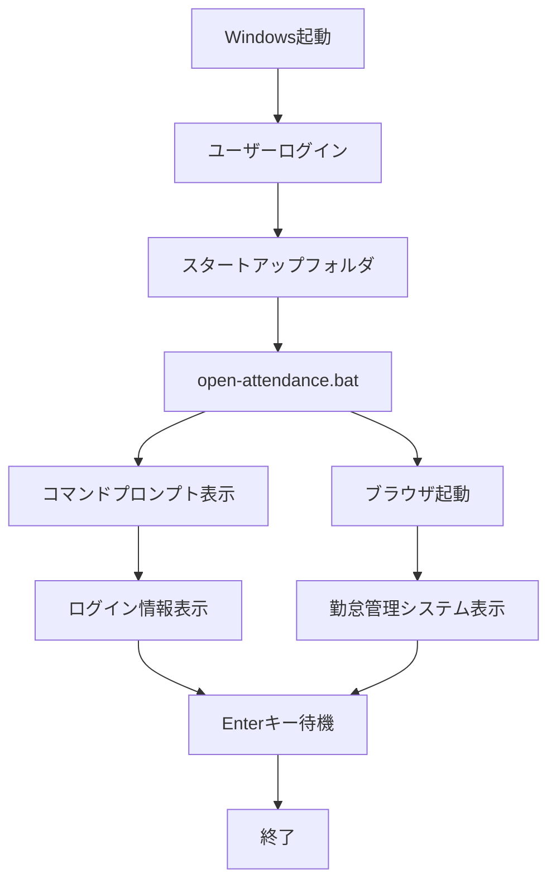
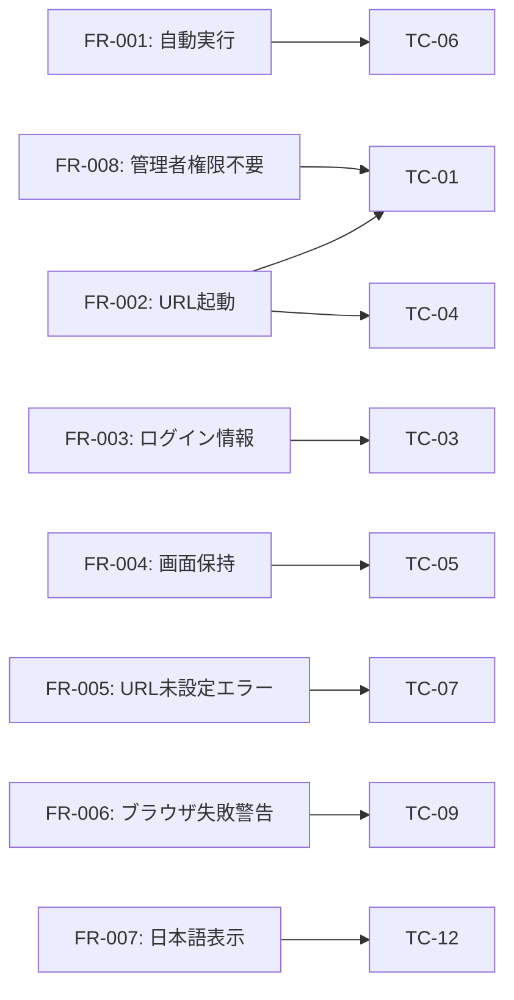

# 要件定義書

**プロジェクト名:** 勤怠管理システム自動起動バッチ  
**作成日:** 2025-12-07  
**バージョン:** 1.0  
**ステータス:** 確定

---

## 1. プロジェクト概要

### 1.1 目的
Windows端末の起動時に勤怠管理システムを自動的にブラウザで表示することで、組織内のユーザーによる日々の勤怠入力漏れを防止する。

### 1.2 背景
- 組織内で勤怠入力の漏れが頻発している
- ユーザーが手動でURLを開く手間を省きたい
- 端末起動時に強制的に勤怠管理システムを表示することで、入力忘れを防止する

### 1.3 スコープ
- **対象OS:** Windows 10 / Windows 11
- **対象ユーザー:** 組織内の全従業員
- **配布方法:** IT部門からの配布またはセルフインストール

### 1.4 システム概要図

---

## 2. 機能要件

### FR-001: Windows起動時の自動実行
**優先度:** 必須  
**説明:** システムはWindows起動後、ユーザーログイン時に自動実行されること  
**検証方法:** Windowsスタートアップフォルダに配置し、再起動後の自動実行を確認

### FR-002: ブラウザでのURL自動起動
**優先度:** 必須  
**説明:** システムは勤怠管理システムのURLを既定ブラウザで自動的に開くこと  
**検証方法:** バッチ実行後、3秒以内にブラウザで指定URLが開くことを確認

### FR-003: ログイン情報の表示
**優先度:** 必須  
**説明:** システムは現在ログイン中のユーザー情報（ユーザー名、セッション名、状態、ログイン時刻）をコマンドプロンプトに表示すること  
**検証方法:** コマンドプロンプトにquery userコマンドの出力が正しく表示されることを確認

### FR-004: コマンドプロンプトの画面保持
**優先度:** 必須  
**説明:** システムはコマンドプロンプトウィンドウをEnterキー押下まで保持すること  
**検証方法:** バッチ実行後、Enterキーを押すまでウィンドウが閉じないことを確認

### FR-005: URL未設定エラーの表示
**優先度:** 必須  
**説明:** システムはURL未設定時にエラーメッセージを表示し、処理を中断すること  
**検証方法:** ATTENDANCE_URL変数を空にして実行し、エラーメッセージが表示されることを確認

### FR-006: ブラウザ起動失敗時の警告表示
**優先度:** 必須  
**説明:** システムはブラウザ起動失敗時に警告メッセージを表示し、処理を継続すること  
**検証方法:** デフォルトブラウザ未設定環境で実行し、警告メッセージが表示されることを確認

### FR-007: 日本語メッセージの正常表示
**優先度:** 必須  
**説明:** システムは日本語メッセージを文字化けなく正常に表示すること  
**検証方法:** 各メッセージが日本語で正しく表示されることを確認（文字化けなし）

### FR-008: 管理者権限不要での動作
**優先度:** 必須  
**説明:** システムは通常ユーザー権限で動作すること（管理者権限不要）  
**検証方法:** 通常ユーザー権限でバッチを実行し、正常動作することを確認

---

## 3. 非機能要件

### NFR-001: ファイルサイズ
**カテゴリ:** パフォーマンス  
**説明:** バッチファイルサイズは3KB以内であること  
**測定方法:** ファイルプロパティでサイズを確認

### NFR-002: 対応OS
**カテゴリ:** 互換性  
**説明:** Windows 10およびWindows 11で動作すること  
**検証方法:** 両OS環境でテスト実行し、正常動作を確認

### NFR-003: 文字コード対応
**カテゴリ:** 互換性  
**説明:** Shift-JISまたはUTF-8 BOMに対応すること  
**検証方法:** 両文字コードで保存したファイルが正常動作することを確認

### NFR-004: ブラウザ起動時間
**カテゴリ:** パフォーマンス  
**説明:** ログイン後3秒以内にブラウザが起動すること  
**測定方法:** バッチ実行からブラウザウィンドウ表示までの時間を計測

### NFR-005: 保守性
**カテゴリ:** 保守性  
**説明:** コードは保守性が高く、コメントで説明されていること  
**検証方法:** コードレビューでコメントの充実度と可読性を確認

### NFR-006: エラーハンドリング
**カテゴリ:** 信頼性  
**説明:** 想定されるエラー（URL未設定、ブラウザ起動失敗、ログイン情報取得失敗）に対して適切なエラーハンドリングが実装されていること  
**検証方法:** 異常系テストケース（TC-07～TC-10）で確認

---

## 4. 制約条件

### 4.1 技術的制約
- Windows環境専用（macOS/Linux非対応）
- バッチファイル形式（.bat）
- スタートアップフォルダへの手動配置が必要
- URLはバッチファイル内にハードコーディング

### 4.2 運用制約
- 各ユーザーが個別にスタートアップフォルダに配置する必要がある
- URL変更時はバッチファイルの編集が必要
- デフォルトブラウザが設定されている必要がある

### 4.3 セキュリティ制約
- URLは平文でバッチファイル内に記載される（社内利用のみ想定）
- パスワードはURLに埋め込まない
- ユーザー情報はローカルシステムのセッション情報のみ取得

---

## 5. ユーザーストーリー

### US-001: 勤怠入力の自動リマインド
**As a** 従業員  
**I want** 端末起動時に勤怠管理システムが自動的に開く  
**So that** 勤怠入力を忘れずに実施できる

**受入基準:**
- Windows起動後、自動的にコマンドプロンプトが表示される
- 勤怠管理システムのURLが既定ブラウザで開かれる
- ログイン時刻が画面に表示される

### US-002: ログイン時刻の確認
**As a** 従業員  
**I want** 端末へのログイン時刻を確認できる  
**So that** 正確な勤怠入力ができる

**受入基準:**
- コマンドプロンプトにログイン時刻が表示される
- 表示内容が正確である（query userの出力）

### US-003: 簡単なセットアップ
**As a** IT管理者  
**I want** バッチファイルの配布と設定が簡単である  
**So that** 全従業員に迅速に展開できる

**受入基準:**
- スタートアップフォルダへのコピーのみで設定完了
- URL変更が1行の編集で可能
- 管理者権限不要

---

## 6. テスト要件

### 6.1 テストカバレッジ
- 正常系テスト: 6項目（TC-01～TC-06）
- 異常系テスト: 4項目（TC-07～TC-10）
- エッジケーステスト: 3項目（TC-11～TC-13）

### 6.2 合格基準
- TC-01～TC-06が全て合格で本番適用OK
- TC-07～TC-10で最低1項目合格で条件付き適用可
- 失敗項目がある場合は原因分析と改善が必要

### 6.3 テスト環境
- Windows 10環境
- Windows 11環境
- 仮想マシン（VirtualBox / Hyper-V）
- RDP環境（複数ユーザーセッションテスト用）

### 6.4 機能要件とテストケースのマッピング

---

## 7. 成功指標

### 7.1 技術的成功指標
- 全テストケース合格率: 100%（実機確認を除く）
- バッチファイルサイズ: 3KB以内
- ブラウザ起動時間: 3秒以内

### 7.2 ビジネス成功指標
- 勤怠入力漏れの減少: 30%以上削減（導入後3ヶ月）
- ユーザー満足度: 80%以上（アンケート調査）
- サポート問い合わせ: 週5件以内

---

## 8. リスクと対策

### リスク1: ブラウザ起動失敗
**影響度:** 中  
**発生確率:** 低  
**対策:** エラーメッセージ表示、ユーザーマニュアルでトラブルシューティング手順を提供

### リスク2: 文字化け
**影響度:** 中  
**発生確率:** 低  
**対策:** UTF-8対応（chcp 65001設定）、セットアップガイドで文字コード設定手順を記載

### リスク3: スタートアップ配置ミス
**影響度:** 低  
**発生確率:** 中  
**対策:** セットアップガイドで詳細な配置手順を記載、shell:startupショートカットの利用

### リスク4: URL変更時の対応漏れ
**影響度:** 低  
**発生確率:** 低  
**対策:** セットアップガイドでURL変更手順を明記

---

## 9. 依存関係

### 9.1 前提条件
- Windows 10 / Windows 11がインストールされていること
- デフォルトブラウザが設定されていること
- インターネット接続が可能であること（社内ネットワーク経由）

### 9.2 外部依存
- Windowsコマンド: query user, start, chcp, pause
- 既定ブラウザ（Edge / Chrome / Firefox等）

---

## 10. 承認

| 役割 | 名前 | 承認日 | 署名 |
|------|------|--------|------|
| 要件定義者 | __________ | __________ | ☐ |
| レビュー者 | __________ | __________ | ☐ |
| 承認者 | __________ | __________ | ☐ |

---

**作成日:** 2025-12-07  
**最終更新:** 2025-12-07  
**バージョン:** 1.0
