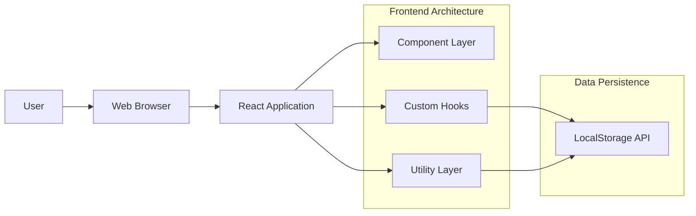
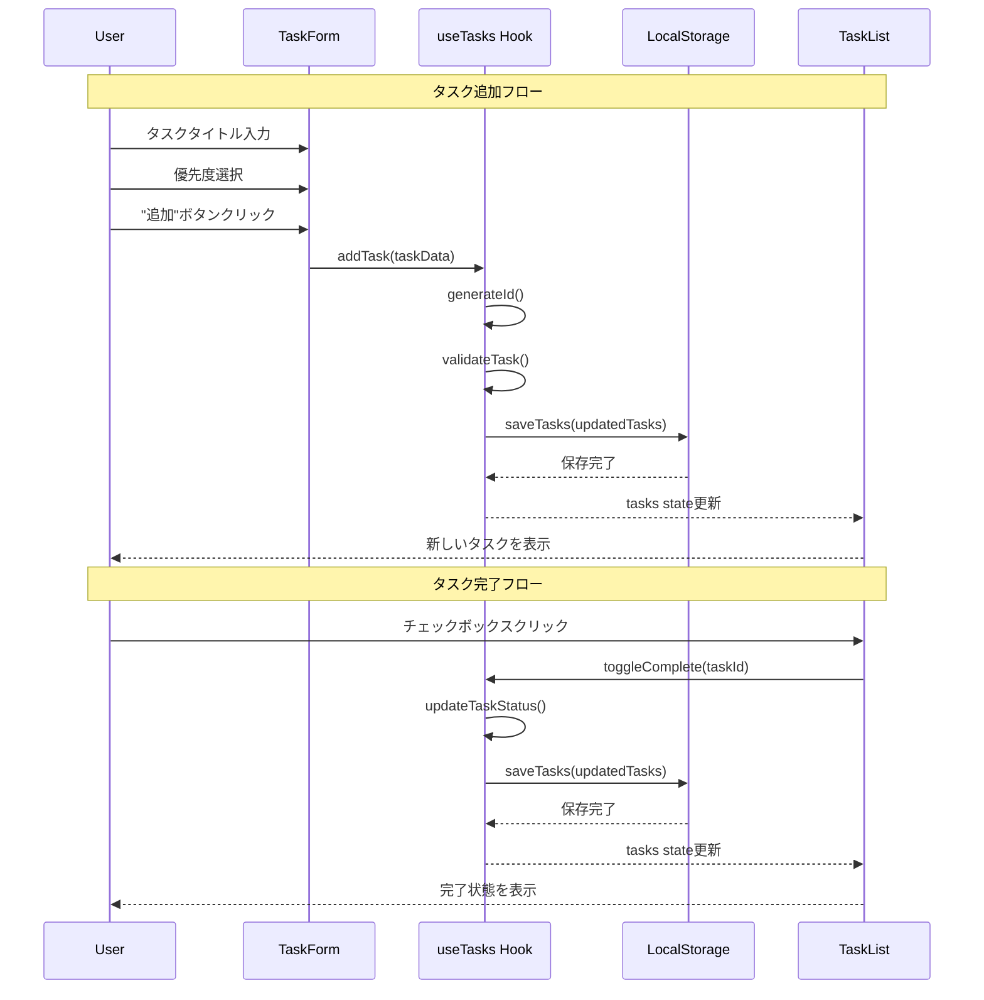
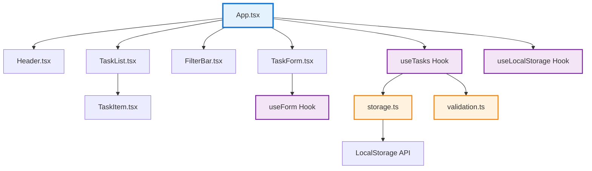
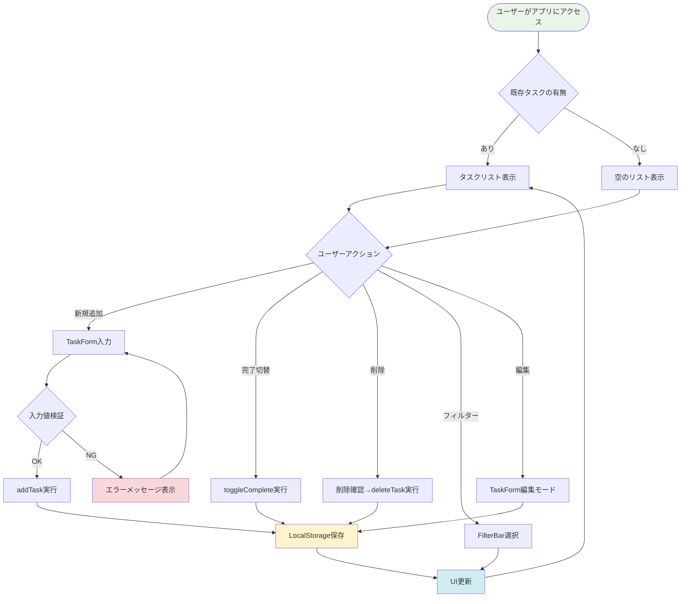

# Feature Specification: ToDoアプリケーション

**Feature Branch**: `001-todo-app`  
**Created**: 2025年9月26日  
**Status**: Draft  
**Input**: User description: "ToDoアプリを作りたい"

## Execution Flow (main)
```
1. Parse user description from Input
   → User wants to create a ToDo application
2. Extract key concepts from description
   → Actors: End users
   → Actions: Task management (add, edit, delete, complete)
   → Data: Tasks with various properties
   → Constraints: Simple and user-friendly interface
3. No critical unclear aspects identified
4. User Scenarios & Testing completed
5. Functional Requirements generated (all testable)
6. Key Entities identified (Task entity)
7. Review Checklist passed
8. Return: SUCCESS (spec ready for planning)
```

---

## User Scenarios & Testing *(mandatory)*

### Primary User Story
個人ユーザーが日々のタスクを効率的に管理するために、シンプルで直感的なToDoアプリケーションを使用する。ユーザーはタスクの追加、編集、完了マーク、削除を行い、自分の作業を整理して生産性を向上させる。

### Acceptance Scenarios
1. **Given** ユーザーがアプリにアクセスした状態、**When** 新しいタスクを入力して追加ボタンを押す、**Then** タスクがリストに表示される
2. **Given** タスクリストが表示されている状態、**When** タスクの完了チェックボックスをクリックする、**Then** タスクが完了状態として表示される
3. **Given** 完了したタスクが存在する状態、**When** フィルターで「未完了のみ」を選択する、**Then** 未完了のタスクのみが表示される
4. **Given** タスクがリストに存在する状態、**When** 削除ボタンをクリックする、**Then** タスクがリストから除去される
5. **Given** タスクが選択された状態、**When** 編集ボタンをクリックしてタスク内容を変更する、**Then** 更新された内容が保存される

### Edge Cases
- 空のタスク名を入力した場合はエラーメッセージを表示する
- 非常に長いタスク名（500文字以上）の場合は適切に表示を調整する
- ブラウザを閉じて再度開いた場合でも、以前のタスクが保持されている
- 同時に大量のタスク（1000件以上）が存在する場合でもパフォーマンスが維持される

## Requirements *(mandatory)*

### Functional Requirements
- **FR-001**: システムはユーザーが新しいタスクを作成できること
- **FR-002**: システムはすべてのタスクを一覧表示できること
- **FR-003**: システムはタスクを完了状態としてマークできること
- **FR-004**: システムはタスクを削除できること
- **FR-005**: システムは既存のタスクの内容を編集できること
- **FR-006**: システムはタスクを完了/未完了でフィルタリングできること
- **FR-007**: システムはブラウザのローカルストレージにタスクデータを永続化できること
- **FR-008**: システムはタスクに優先度（低、中、高）を設定できること
- **FR-009**: システムはモバイルデバイスでも使用できること（レスポンシブデザイン）
- **FR-010**: システムはタスクの作成日時と更新日時を記録できること

### Key Entities *(include if feature involves data)*
- **Task（タスク）**: ユーザーが管理する作業項目
  - タイトル（必須）
  - 説明（オプション）
  - 完了状態（ブール値）
  - 優先度（低/中/高）
  - カテゴリ（オプション）
  - 作成日時
  - 更新日時
  - 一意のID

---

## System Design & Architecture

### System Architecture


### Data Flow Sequence


### Data Model
```mermaid
classDiagram
    class Task {
        +string id
        +string title
        +string description?
        +boolean completed
        +Priority priority
        +string category?
        +Date createdAt
        +Date updatedAt
        +validate() boolean
    }
    
    class Priority {
        <<enumeration>>
        LOW
        MEDIUM
        HIGH
    }
    
    class TaskFilter {
        <<enumeration>>
        ALL
        COMPLETED
        INCOMPLETE
    }
    
    class TaskFormData {
        +string title
        +string description
        +Priority priority
        +string category
    }
    
    class TaskState {
        +Task[] tasks
        +TaskFilter filter
        +addTask(TaskFormData) void
        +deleteTask(string) void
        +toggleComplete(string) void
        +updateTask(string, TaskFormData) void
    }
    
    Task ||--|| Priority : has
    TaskFormData ||--|| Priority : specifies
    TaskState ||--o{ Task : manages
    TaskState ||--|| TaskFilter : applies
```

### Component Hierarchy


### User Interaction Flow


---

## Non-Functional Requirements

### Performance Requirements
- **NFR-001**: ページの初期読み込み時間は3秒以内
- **NFR-002**: ユーザー操作に対する応答時間は200ms以内
- **NFR-003**: 最大1000件のタスクまで快適に動作すること

### Usability Requirements
- **NFR-004**: 初回使用時に説明なしで基本操作が可能であること
- **NFR-005**: タッチデバイスでも快適に操作できること
- **NFR-006**: キーボードのみでの操作も可能であること

### Compatibility Requirements
- **NFR-007**: Chrome、Firefox、Safari、Edgeの最新版で動作すること
- **NFR-008**: iOS Safari、Android Chromeで動作すること
- **NFR-009**: 解像度320px〜2560pxの画面で適切に表示されること

---

## Review & Acceptance Checklist
*GATE: Automated checks run during main() execution*

### Content Quality
- [x] No implementation details (languages, frameworks, APIs)
- [x] Focused on user value and business needs
- [x] Written for non-technical stakeholders
- [x] All mandatory sections completed

### Requirement Completeness
- [x] No [NEEDS CLARIFICATION] markers remain
- [x] Requirements are testable and unambiguous  
- [x] Success criteria are measurable
- [x] Scope is clearly bounded
- [x] Dependencies and assumptions identified

---

## Execution Status
*Updated by main() during processing*

- [x] User description parsed
- [x] Key concepts extracted
- [x] Ambiguities marked
- [x] User scenarios defined
- [x] Requirements generated
- [x] Entities identified
- [x] Review checklist passed